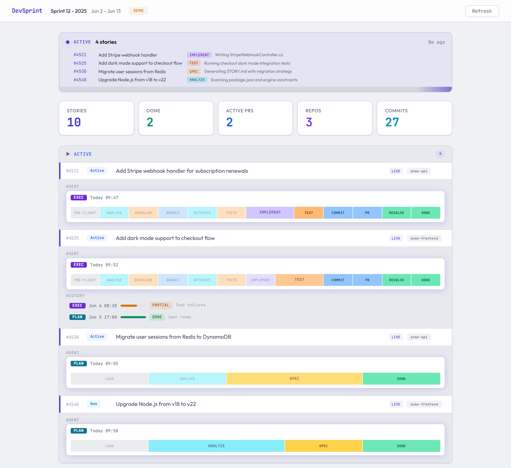
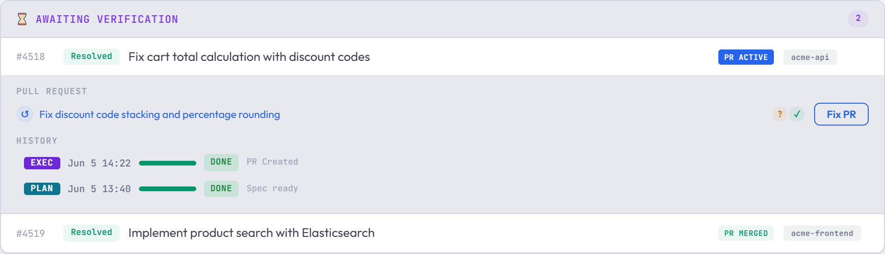
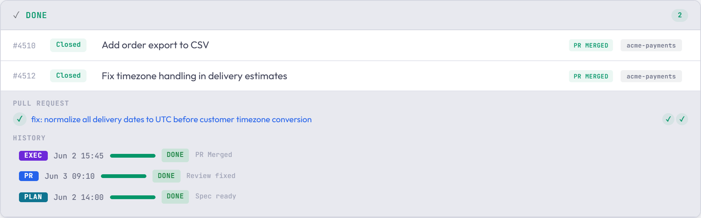
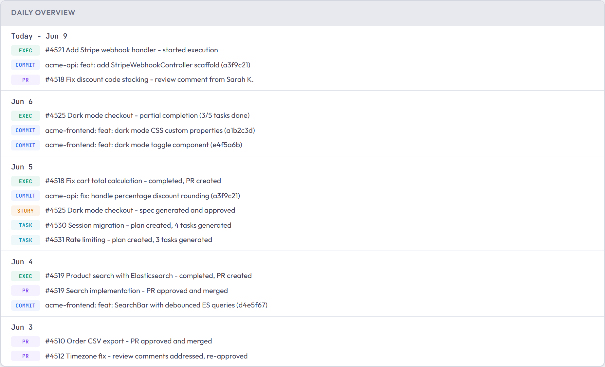
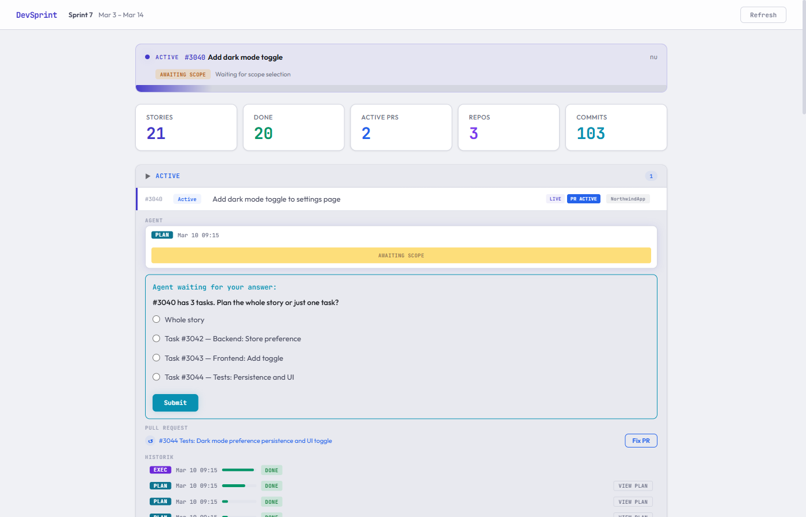

# claude-devsprint-plugin

A sprint automation plugin for [Claude Code](https://docs.anthropic.com/en/docs/claude-code) that supports both **Azure DevOps** and **GitHub**.

Point it at your sprint, and it will read your stories, analyze the relevant repos, write implementation plans, generate code, and create PRs — all without leaving your terminal. Run `/devsprint-execute` and walk away. Come back to pull requests ready for review. Verify each PR, then click **Approve** on the dashboard to close the item.

### Supported providers

| | Azure DevOps | GitHub |
|---|---|---|
| **Work items** | Work Items (User Story, Task, Bug) | Issues (with labels) |
| **Sprints** | Iterations | Milestones |
| **PRs** | Azure DevOps Pull Requests | GitHub Pull Requests |
| **Auth** | PAT (stored in config) | OAuth (browser login) |
| **Parent linking** | `System.Parent` field | "Parent: #N" in issue body |

### Quick switch between providers

Both provider configs are stored side-by-side in `.planning/devsprint-config.json`. Switch with:

```
/devsprint-setup github    →  switch to GitHub
/devsprint-setup azdo      →  switch to Azure DevOps
```

This changes the active `provider` field — credentials for both providers are kept.

## What can it do?

- **View your sprint** from the terminal — stories, tasks, state, descriptions, all color-coded
- **Create stories and tasks** from natural language — just describe what you need
- **Analyze stories** — reads the target repo, traces code paths, identifies the files that need changes, and writes a detailed implementation spec
- **Execute stories autonomously** — creates a feature branch, writes the code, runs tests, commits, pushes, and creates a PR linked to the story
- **Batch mode** — run `/devsprint-execute` with no arguments and it loops through every story in your sprint. Errors on one story don't block the next
- **Fix PR comments** — `/devsprint-pr-fix <story-id>` fetches review comments, fixes them, and pushes

Zero external dependencies. Just Node.js built-ins and MCP servers for provider access.

## What it looks like

End-to-end example: **`/devsprint-create`** → **`/devsprint-plan`** → **`/devsprint-execute`** → review PR → **`/devsprint-pr-fix`**.

```
> /devsprint-create Add dark mode toggle: 1) Backend user preference 2) Frontend toggle 3) Tests

Creating:
  [User Story] "Add dark mode toggle to settings page"
    [Task] "Backend: Store dark mode preference in user profile"
    [Task] "Frontend: Add toggle switch to settings page"
    [Task] "Tests: Dark mode preference persistence and UI toggle"

╔══════════════════════════════════════════════════════╗
║  Story #3040 created                                 ║
╚══════════════════════════════════════════════════════╝

  ✓ #3040 [User Story] "Add dark mode toggle to settings page"
    ✓ #3041 [Task] "Backend: Store dark mode preference in user profile"
    ✓ #3042 [Task] "Frontend: Add toggle switch to settings page"
    ✓ #3043 [Task] "Tests: Dark mode preference persistence and UI toggle"

Sprint: Sprint 7

Next step: /devsprint-plan 3040 to analyze and create spec.
```

```
> /devsprint-plan 3040

#3040 → NorthwindApp (auto-detected)

### #3040 — Add dark mode toggle to settings page (New)

My understanding:
  Allow users to switch between light and dark mode from their settings.
  The preference is stored in the user profile and applied on login.

Work type: Code change
Target repo: NorthwindApp

Repo analysis:
  Tech stack: C# / .NET 8 + React 18 / TypeScript
  Key files:
    src/Api/Controllers/UserController.cs — user profile endpoints
    src/Api/Models/UserProfile.cs — profile entity (add DarkMode bool)
    src/Web/pages/Settings.tsx — settings page (add toggle)
    src/Web/context/ThemeContext.tsx — theme provider (already exists)
  Code flow: UserController.UpdateProfile() → UserService → UserRepository

STORY.md written to NorthwindApp/.planning/stories/3040.md

Changes?
> ok

Planning complete. Run /devsprint-execute 3040 to implement.
```

```
> /devsprint-execute 3040

╔══════════════════════════════════════════════════════╗
║              Pre-flight Status Check                 ║
╚══════════════════════════════════════════════════════╝

Will execute:
  → #3040 — Add dark mode toggle to settings page
    State: New | Tasks: 0/3 done | Repo: NorthwindApp

━━━ [1/1] Story #3040 — Add dark mode toggle to settings page ━━━

  Baseline tests green — proceeding.
  Created branch feature/3040-dark-mode-toggle from develop

  Task status updates:
    #3041 (Backend: Store dark mode preference): Active ✓
    #3042 (Frontend: Add toggle switch): Active ✓
    #3043 (Tests: Dark mode persistence and UI): Active ✓

  ... implementing (TDD: write tests → implement → verify) ...

╔══════════════════════════════════════════╗
║           Execution Complete             ║
╚══════════════════════════════════════════╝

  ✓ #3040 — Add dark mode toggle to settings page
     Branch: feature/3040-dark-mode-toggle
     Tests: 22 passed, 0 failed (dotnet test) — all passed
     PR: https://dev.azure.com/.../pullrequest/187
```

The story is now in the dashboard's **Awaiting verification** group. Review the PR. Leave comments on anything that needs fixing, then run **`/devsprint-pr-fix`**:

```
> /devsprint-pr-fix 3040

=== PR #187: #3040 Add dark mode toggle to settings page ===
Status: active
Branch: feature/3040-dark-mode-toggle -> develop

=== Unresolved Review Comments (2) ===

File: src/Api/Models/UserProfile.cs
  Line 24: "Should default to false, not null"

File: src/Web/pages/Settings.tsx
  Line 89: "Use the existing ToggleSwitch component instead of a raw checkbox"

Fixing all 2 comments...
  ✓ Fixed UserProfile.cs — changed DarkMode default to false
  ✓ Fixed Settings.tsx — replaced checkbox with ToggleSwitch component
  Tests: 22 passed, 0 failed

=== PR Fix Complete ===
Fixes pushed: 2 commits
PR: https://dev.azure.com/.../pullrequest/187
```

### Batch mode — plan and execute an entire sprint

Run **`/devsprint-plan`** and **`/devsprint-execute`** without a story ID and they process everything autonomously. Walk away and come back to PRs.

```
> /devsprint-plan

=== Analysis: Sprint 7 ===

You have 3 stories:

  [US] #3040 -- Add dark mode toggle (New) → NorthwindApp
  [US] #3044 -- Email notification preferences (New) → NorthwindApp
  [US] #3048 -- Fix timezone bug in scheduler (New) → NorthwindApp

Analyzing...

#3040 — already analyzed, keeping existing spec.
#3044 → NorthwindApp (same as other stories)
  ... analyzing repo, generating spec ...
  STORY.md written to NorthwindApp/.planning/stories/3044.md
  Changes?
> ok

#3048 → NorthwindApp (same as other stories)
  ... analyzing repo, generating spec ...
  STORY.md written to NorthwindApp/.planning/stories/3048.md
  Changes?
> ok

=== Analysis Complete ===

Stories planned:
  #3044 Email notification preferences → NorthwindApp/.planning/stories/3044.md
  #3048 Fix timezone bug in scheduler → NorthwindApp/.planning/stories/3048.md

Kept existing:
  #3040 Add dark mode toggle (already analyzed — kept existing spec)

Planning complete. Run /devsprint-execute to implement all stories.
```

```
> /devsprint-execute

╔══════════════════════════════════════════════════════╗
║              Pre-flight Status Check                 ║
╚══════════════════════════════════════════════════════╝

Already completed:
  ✓ #3040 — Add dark mode toggle
    Executed: 2026-03-08 | PR: https://dev.azure.com/.../pullrequest/187

Will execute:
  → #3044 — Email notification preferences
    State: New | Tasks: 0/4 done | Repo: NorthwindApp
  → #3048 — Fix timezone bug in scheduler
    State: New | Tasks: 0/2 done | Repo: NorthwindApp

Summary: 2 to execute, 1 already done

━━━ [1/2] Story #3044 — Email notification preferences ━━━
  Created branch feature/3044-email-notifications from develop
  ... implementing ...
  PR created ✓

━━━ [2/2] Story #3048 — Fix timezone bug in scheduler ━━━
  Created branch feature/3048-timezone-fix from develop
  ... implementing ...
  PR created ✓

╔══════════════════════════════════════════╗
║           Execution Complete             ║
╚══════════════════════════════════════════╝

Sprint: Sprint 7
Stories processed: 2 | Previously completed: 1

  ✓ #3044 — Email notification preferences
     Tests: 31 passed, 0 failed
     PR: https://dev.azure.com/.../pullrequest/188

  ✓ #3048 — Fix timezone bug in scheduler
     Tests: 18 passed, 0 failed
     PR: https://dev.azure.com/.../pullrequest/189

Previously completed:
  ✓ #3040 — Add dark mode toggle
     Completed: 2026-03-08 | PR: https://dev.azure.com/.../pullrequest/187

All pull requests:
  https://dev.azure.com/.../pullrequest/187
  https://dev.azure.com/.../pullrequest/188
  https://dev.azure.com/.../pullrequest/189
```

Stories now appear in the dashboard under **Awaiting verification**. Review the PRs, leave comments, then run **`/devsprint-pr-fix`** for each. After merging, click **Approve** on the dashboard to close:

```
> /devsprint-pr-fix 3044
  ... fixes 3 review comments, pushes ...

> /devsprint-pr-fix 3048
  ... fixes 1 review comment, pushes ...
```

## Quick start

```
/devsprint-setup [github|azdo] →  Connect to GitHub (or "azdo" for Azure DevOps)
/devsprint-sprint             →  See your sprint board
/devsprint-create <description> → Create stories & tasks (or issues) from natural language
/devsprint-plan [story-id]    →  Analyze stories → generate specs
/devsprint-execute [story-id] →  Implement, commit, push, create PR (items not auto-resolved)
/devsprint-pr-fix <story-id>  →  Fix PR review comments automatically
```

**The typical workflow:**
1. `/devsprint-sprint` — see what's in the sprint
2. `/devsprint-create` — add missing stories or tasks (optional)
3. `/devsprint-plan` — analyze stories, auto-detect repos, generate implementation specs
4. `/devsprint-execute` — implement everything and create PRs
5. Review PRs, then **Approve** from the dashboard to close items

## Prerequisites

- [Claude Code](https://docs.anthropic.com/en/docs/claude-code) CLI installed
- Node.js (for the local helper script and dashboard)

**GitHub:**
- MCP server registered automatically by `/devsprint-setup github`
- OAuth browser login on first use — no token stored locally

**Azure DevOps:**
- MCP server registered automatically by `/devsprint-setup azdo`
- PAT with scopes: Work Items (Read & Write), Code (Read & Write), Pull Requests (Read & Write)

**Requirements for stories to appear:**

| | GitHub | Azure DevOps |
|---|---|---|
| Sprint | Assigned to a milestone | Assigned to an iteration |
| Assignee | Assigned to you | Assigned to you |

## Installation

```bash
git clone https://github.com/kloppnr1/claude-devsprint-plugin.git
cd claude-devsprint-plugin
./install.sh
```

This copies commands, the helper script, and `.mcp.json` to `~/.claude/`. Restart Claude Code to pick up changes.

### Configure provider

Run the setup command in any project directory, specifying your provider:

```
/devsprint-setup github    →  connect to GitHub
/devsprint-setup azdo      →  connect to Azure DevOps
```

Both configs are stored side-by-side in `.planning/devsprint-config.json`. Switching providers keeps both sets of credentials — only the active `provider` field changes.

This:
1. Registers the appropriate MCP server in `.mcp.json`
2. For GitHub: opens a browser window for **OAuth login** — no token stored locally
3. For Azure DevOps: prompts for a PAT and optionally configures it for the standalone web dashboard

### Verify connection

```
/devsprint-test
```

Tests the MCP connection and optionally verifies the dashboard PAT.

## Architecture

### MCP-first design

All Azure DevOps API communication goes through the [official Microsoft MCP server](https://www.npmjs.com/package/@azure-devops/mcp) (`@azure-devops/mcp`). This gives Claude native tool access to 86+ Azure DevOps operations via OAuth authentication.

The local helper script (`devsprint-tools.cjs`) handles only operations that can't use MCP:
- **`create-branch`** — local git operations (stash, fetch, checkout)
- **`parse-file`** — binary file parsing (.msg, .eml, .docx)
- **`report-status` / `clear-status`** — dashboard agent status file I/O

The dashboard server (`dashboard/server.cjs`) has its own minimal HTTP client for the 2-3 read-only Azure DevOps API calls it needs (sprint data, PR status). It uses a PAT from `.planning/devsprint-config.json`.

### Multi-provider ready

The architecture supports adding additional MCP servers alongside Azure DevOps. For example, GitHub:

```json
{
  "mcpServers": {
    "azure-devops": {
      "command": "npx",
      "args": ["-y", "@azure-devops/mcp", "verdo365"]
    },
    "github": {
      "type": "url",
      "url": "https://api.githubcopilot.com/mcp/"
    }
  }
}
```

## Dashboard

A real-time web dashboard for monitoring your sprint. Shows story status, active agent runs, PR status, execution history, and git activity — all auto-updating.



Click any story to expand it and see PR status, reviewer votes, execution history, and available actions:



Completed stories show the full lifecycle — Plan, PR Fix, and Exec runs with progress bars:



The daily overview shows a chronological feed of all sprint activity:



### Start the dashboard

After installing the plugin and running `/devsprint-setup` in your project:

```bash
# From the plugin directory
node dashboard/server.cjs --cwd /path/to/your/project
```

That's it. Open `http://localhost:3000` in your browser.

`--cwd` is the project directory where you ran `/devsprint-setup` (the one with `.planning/`). Example:

```bash
node dashboard/server.cjs --cwd ~/source/repos/MyApp
```

The dashboard starts immediately — no build step, no dependencies, no config. It reads `.planning/` files and queries your configured provider (GitHub or Azure DevOps) using the credentials from `/devsprint-setup`.

### Features

- **Story groups** — stories are automatically classified into status groups:
  - **Active** — agent is currently working on the story
  - **Awaiting verification** — story is Resolved with a pending PR. Click **Approve** to close it after staging verification
  - **Partial** — execution started but didn't complete
  - **Planned** — analyzed and ready for execution. Click **Execute** to start
  - **Not planned** — in sprint but not yet analyzed. Click **Analyze** to plan it
  - **Blocked** — title contains "BLOKERET" or execution was skipped
  - **Done** — Closed/Done in the provider
- **Live agent status** — see what the agent is doing right now (which step, which story)
- **Expandable run history** — click completed runs to see step-by-step log with timestamps
- **PR status** — badges show active/merged/rejected, with a "Fix PR" button for active PRs
- **One-click actions** — Plan, Execute, Re-analyze, Fix PR, and Approve directly from the dashboard
- **Auto-refresh** — polls every 5 seconds for agent status, 60 seconds for full data refresh

### Task-level planning from the dashboard

When you click **Analyze** on a story that has multiple tasks in New or Active state, the agent asks which scope you want — directly in the dashboard:

1. Click **Analyze** (or **Re-analyze**) on a story
2. The agent loads the story and discovers its tasks
3. A question panel appears inline under the story's agent section asking for your scope choice
4. Pick **Whole story** to plan everything, or select a specific task
5. Click **Submit** — the agent continues with your choice



If you select a single task, the agent generates a focused TASK.md spec covering only that task. You can then click **Execute** to implement just that task — it creates a feature branch, makes the changes described in the task spec, runs tests, creates a PR, and resolves the task in Azure DevOps. Other tasks on the story are left untouched.

### How it works

The dashboard reads from files in `.planning/`:
- `devsprint-task-map.json` — which stories are planned and where
- `devsprint-execution-log.json` — execution results per story
- `devsprint-agent-status.json` — real-time agent progress

It also queries your configured provider (GitHub or Azure DevOps) for live sprint data and PR status using the credentials from `.planning/devsprint-config.json`.

## Commands

### `/devsprint-setup [github|azdo]`

Registers the appropriate MCP server for the chosen provider and configures credentials. For GitHub, a browser window opens for OAuth login — no token stored locally. For Azure DevOps, prompts for a PAT and optionally configures it for the dashboard. Both provider configs are stored side-by-side; switching only changes the active `provider` field.

### `/devsprint-test`

Tests the MCP connection by querying projects and work items. Also checks dashboard PAT if configured.

### `/devsprint-sprint`

Fetches and displays the current sprint backlog via MCP. Shows stories with tasks, state, and progress.

Defaults to showing only your assigned items. Use `--all` to see the entire sprint, `--detailed` for descriptions and acceptance criteria.

### `/devsprint-create <description>`

Create stories and tasks (or GitHub issues) from a natural language description. Creates work items or issues via MCP — all assigned to the current sprint or milestone.

Examples:
- `/devsprint-create Add notification preferences page` — creates a single User Story
- `/devsprint-create Add CSV export: 1) Backend endpoint 2) Frontend button 3) Tests` — creates a story with 3 tasks
- `/devsprint-create Add tasks to #1205: write tests, update docs` — creates tasks under an existing story

### `/devsprint-plan [story-id | task-id]`

The main analysis pipeline. Run without arguments to plan all assigned stories, or pass an ID to plan a single item.

Already resolved stories are automatically skipped. Previously analyzed stories are skipped unless `--reanalyze` is passed.

### `/devsprint-execute [story-id]`

Execute story plans. Two modes depending on arguments:

- **`/devsprint-execute 1205`** — single story. Creates a feature branch, implements the story spec, creates a PR. Items are NOT auto-resolved — approve from the dashboard after verifying.
- **`/devsprint-execute 1207`** — single task. If a TASK.md spec exists for this ID, only that task is implemented.
- **`/devsprint-execute`** — all stories, fully autonomous. Loops through every story in the task map without user interaction.

PRs are created via MCP and automatically linked to the story.

### `/devsprint-pr-fix <story-id>`

Fix PR review comments. Finds the matching PR via MCP, fetches unresolved review comments, checks out the PR branch, fixes all issues, runs tests, and pushes.

## Project structure

```
claude-devsprint-plugin/
├── .mcp.json                        # MCP server registration (azure-devops)
├── install.sh                       # One-command installer
├── bin/
│   ├── devsprint-tools.cjs          # Local operations helper (git, file parsing, status)
│   └── devsprint-screenshot.cjs     # Puppeteer screenshot tool
├── commands/
│   ├── devsprint-setup.md           # /devsprint-setup — MCP + dashboard config
│   ├── devsprint-test.md            # /devsprint-test — connection verification
│   ├── devsprint-sprint.md          # /devsprint-sprint — sprint backlog display
│   ├── devsprint-create.md          # /devsprint-create — create stories & tasks
│   ├── devsprint-plan.md            # /devsprint-plan — story analysis & spec generation
│   ├── devsprint-execute.md         # /devsprint-execute — story execution & PR creation
│   └── devsprint-pr-fix.md          # /devsprint-pr-fix — fix PR review comments
├── dashboard/
│   ├── server.cjs                   # Dashboard web server (own PAT-based API client)
│   └── index.html                   # Dashboard frontend
├── CONTRIBUTING.md
└── README.md
```

## Security

- GitHub uses OAuth via MCP server — no token stored locally
- Azure DevOps MCP server uses OAuth — credentials are managed by the browser login flow
- Dashboard PAT is stored base64-encoded in `.planning/devsprint-config.json` — this is light obfuscation, not encryption
- Always add `devsprint-config.json` to `.gitignore` — the setup command checks for this
- The local helper script uses only Node.js built-in modules (`fs`, `path`, `child_process`, `zlib`)

## License

MIT
